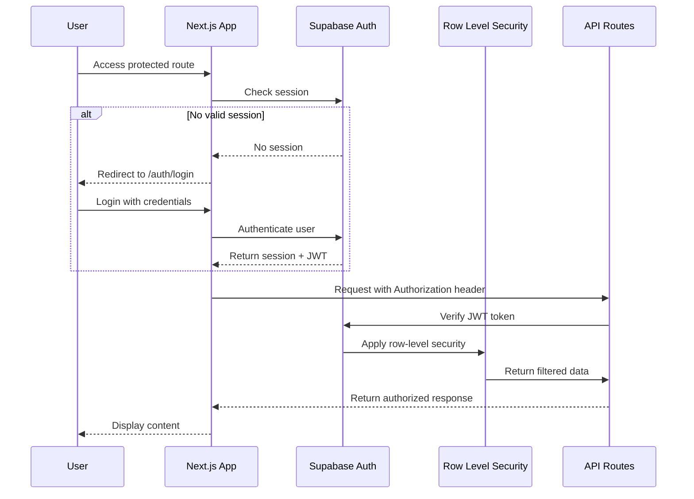

# Backend Architecture

## Service Architecture

### Serverless Architecture (Next.js API Routes)

The backend leverages Next.js API Routes deployed as Vercel serverless functions, optimized for the content automation workflow requirements:

#### Function Organization

```
app/api/
├── campaigns/
│   ├── route.ts                 # GET /api/campaigns, POST /api/campaigns
│   └── [id]/
│       ├── route.ts             # GET/PUT/DELETE /api/campaigns/[id]
│       └── content/
│           └── route.ts         # GET /api/campaigns/[id]/content
├── content/
│   ├── [id]/
│   │   ├── approve/
│   │   │   └── route.ts         # POST /api/content/[id]/approve
│   │   ├── reject/
│   │   │   └── route.ts         # POST /api/content/[id]/reject
│   │   └── versions/
│   │       └── route.ts         # GET /api/content/[id]/versions
│   └── batch/
│       └── route.ts             # POST /api/content/batch (bulk operations)
# Note: n8n workflows are developed externally and access Supabase database directly
# No webhook endpoints needed for n8n integration
├── linkedin/
│   ├── auth/
│   │   └── route.ts             # LinkedIn OAuth callback
│   ├── publish/
│   │   └── route.ts             # POST /api/linkedin/publish
│   └── profiles/
│       └── route.ts             # GET /api/linkedin/profiles
└── admin/
    ├── workflow-trigger/
    │   └── route.ts             # POST /api/admin/workflow-trigger
    └── system-health/
        └── route.ts             # GET /api/admin/system-health
```

## Authentication and Authorization

### Auth Flow


