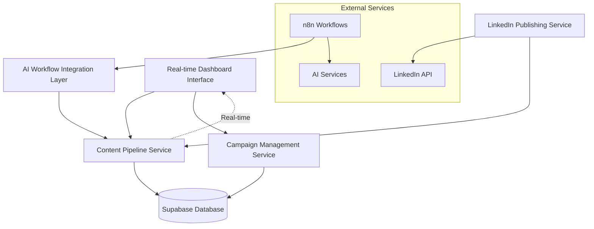

# Components

Based on the architectural patterns and tech stack choices, here are the major logical components across the fullstack system:

## Content Pipeline Service

**Responsibility:** Manages the core content workflow from AI generation through human approval to LinkedIn publishing. Orchestrates interactions between frontend, database, and external services.

**Key Interfaces:**
- REST API endpoints for content CRUD operations
- Webhook receivers for n8n workflow results
- Real-time subscriptions for pipeline status updates

**Dependencies:** Supabase database, n8n webhooks, LinkedIn API

**Technology Stack:** Next.js API Routes, Supabase client, React Query for state management

## Campaign Management Service

**Responsibility:** Handles campaign context switching, template management, and campaign-specific AI instruction configuration. Ensures all content generation respects campaign parameters.

**Key Interfaces:**
- Campaign CRUD API endpoints
- Campaign context validation middleware
- Template management for AI prompts

**Dependencies:** Supabase database, user authentication system

**Technology Stack:** Next.js API Routes, Supabase RLS policies, TypeScript validation schemas

## AI Workflow Integration Layer

**Responsibility:** Manages communication between the web application and n8n automation workflows. Handles webhook authentication, data transformation, and error recovery for AI content generation.

**Key Interfaces:**
- Webhook endpoints for workflow results
- Workflow trigger API for on-demand generation
- Error handling and retry mechanisms

**Dependencies:** n8n instance, AI service APIs, Supabase for state persistence

**Technology Stack:** Next.js API Routes, webhook validation middleware, error boundary patterns

## Real-time Dashboard Interface

**Responsibility:** Provides live updates for content pipeline status, approval workflows, and campaign performance. Optimizes for fast content review and approval decisions.

**Key Interfaces:**
- React components for content cards and approval actions
- Supabase real-time subscriptions
- Mobile-responsive approval interfaces

**Dependencies:** Content Pipeline Service, Campaign Management Service, Supabase real-time

**Technology Stack:** React Server Components, Supabase JavaScript client, shadcn/ui components, Zustand for local state

## LinkedIn Publishing Service

**Responsibility:** Handles LinkedIn API integration for content publishing, performance metric collection, and account management. Manages rate limiting and publishing queue.

**Key Interfaces:**
- LinkedIn API client wrapper
- Publishing queue management
- Performance metrics collection scheduler

**Dependencies:** LinkedIn API, Content Pipeline Service, external cron service

**Technology Stack:** LinkedIn API SDK, Next.js API Routes, Vercel Cron Jobs

## Component Diagrams

