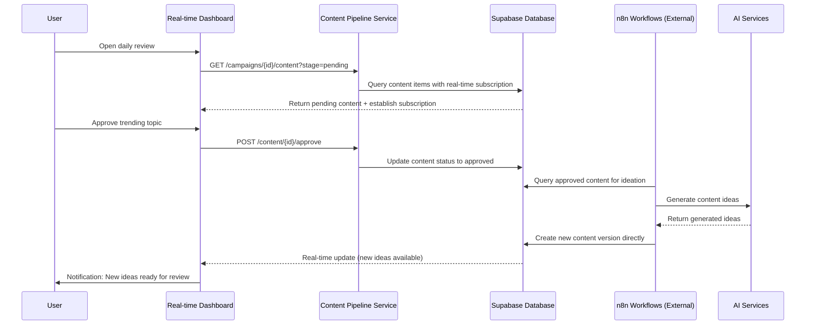
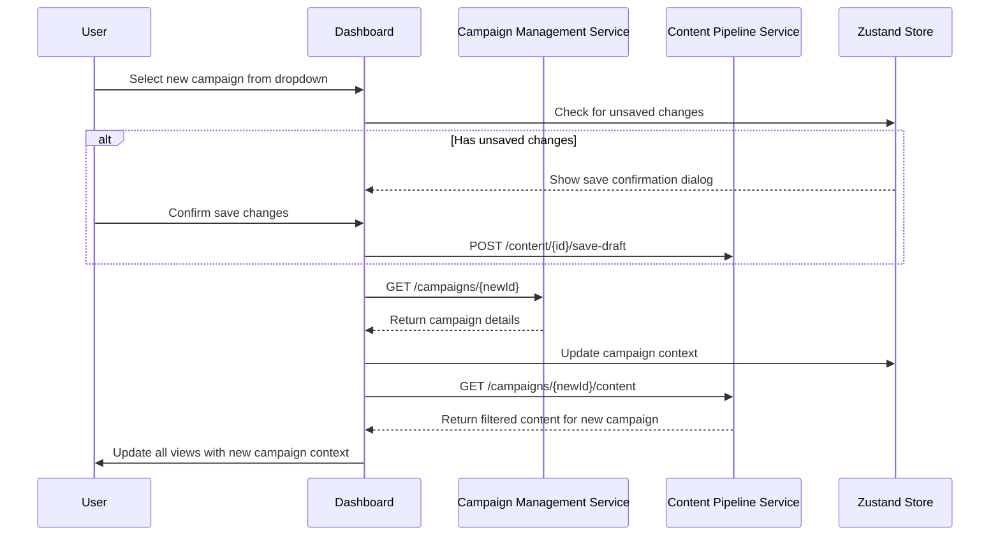
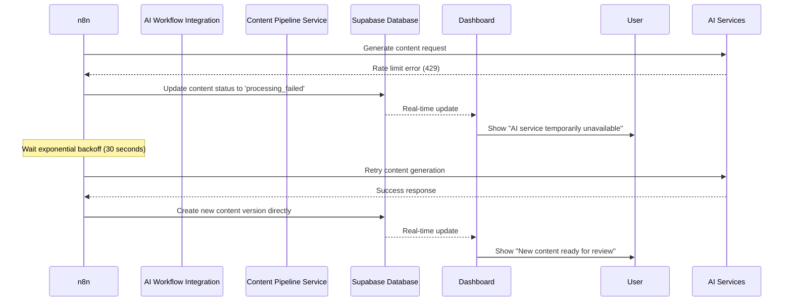

# Core Workflows

The following sequence diagrams illustrate key system workflows that clarify architecture decisions and complex interactions:

## Daily Content Review Workflow

## Campaign Context Switching Workflow

## AI Content Generation Error Recovery Workflow

