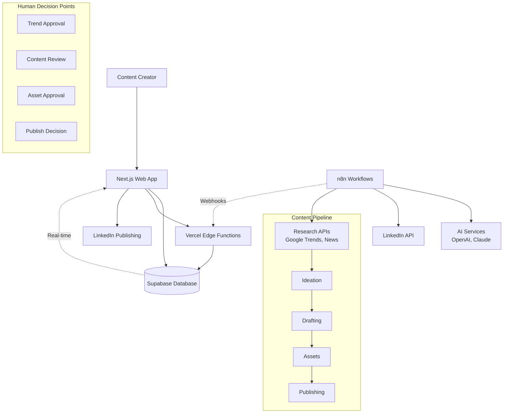

# High Level Architecture

## Technical Summary

The WA Management LinkedIn AI Content Automation System employs a **serverless-first Jamstack architecture** with **Backend-as-a-Service integration** and **external workflow orchestration**. The frontend leverages Next.js 15 App Router with React Server Components for optimal performance, while Supabase provides real-time database capabilities and authentication. Content generation workflows execute in n8n as background processes, communicating via webhooks to maintain UI responsiveness. The system achieves PRD goals through a **human-in-the-loop content pipeline** that automates research and ideation while preserving strategic human oversight at approval points, deployed on Vercel's edge network for global performance.

## Platform and Infrastructure Choice

**Platform:** Vercel + Supabase + n8n
**Key Services:**
- Vercel Edge Functions, Static Site Generation, Global CDN
- Supabase PostgreSQL, Real-time subscriptions, Row Level Security, Edge Functions
- n8n Workflow Automation (self-hosted or cloud)
**Deployment Host and Regions:**
- Vercel: Global edge network (primary: US-East)
- Supabase: US-East-1 (with read replicas as needed)
- n8n: US-East-1 (same region as Supabase for low latency)

## Repository Structure

**Structure:** Monorepo with app-focused organization
**Monorepo Tool:** Native npm workspaces (lightweight, Next.js optimized)
**Package Organization:** Single Next.js app with internal modular structure, shared types and utilities as internal modules, n8n workflows as separate package

## High Level Architecture Diagram

## Architectural Patterns

- **Jamstack Architecture:** Static site generation with serverless APIs and real-time data layer - _Rationale:_ Optimal performance for content review interfaces with instant updates from background AI workflows
- **Backend-as-a-Service (BaaS):** Supabase for database, auth, and real-time features - _Rationale:_ Reduces operational overhead while providing enterprise-grade features for content pipeline management
- **External Workflow Orchestration:** n8n for AI content generation pipelines - _Rationale:_ Separates long-running AI processes from web application, enabling complex automation without blocking user interface
- **Human-in-the-Loop Pattern:** Strategic approval points in automated workflows - _Rationale:_ Maintains content quality and brand control while maximizing automation efficiency
- **Component-Based UI:** React Server Components with selective client hydration - _Rationale:_ Performance optimization for content-heavy interfaces with real-time updates only where needed
- **Event-Driven Integration:** Webhook-based communication between systems - _Rationale:_ Loose coupling between web app, workflows, and AI services for reliability and scalability
- **Real-time State Synchronization:** Supabase subscriptions for live pipeline updates - _Rationale:_ Immediate feedback for content approval actions across multiple browser sessions
