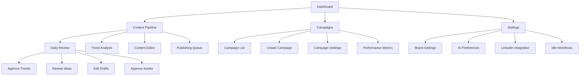
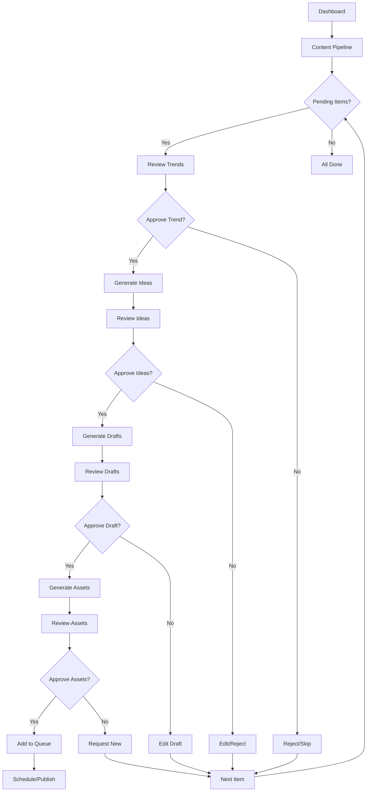
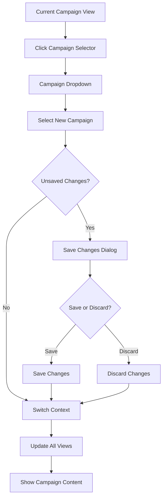
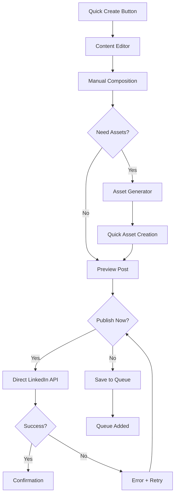

# WA Management App UI/UX Specification

This document defines the user experience goals, information architecture, user flows, and visual design specifications for your WA Management App's AI-powered LinkedIn content automation interface. It serves as your implementation guide for building a streamlined, personal productivity tool that transforms content creation from manual work into an AI-assisted workflow with strategic human oversight.

## Overall UX Goals & Principles

### Target User Personas

**Primary User: Solo Content Creator/Automation Expert**
- Technical professional who builds and manages automation systems
- Values efficiency and wants to eliminate repetitive content tasks
- Comfortable with AI assistance but wants strategic control over output
- Works across multiple LinkedIn campaigns/contexts
- Needs mobile access for quick approvals when away from desk

**Secondary User: Potential Team Member**
- May inherit or collaborate on content workflows
- Needs intuitive interface without extensive training
- Should be able to understand campaign contexts and content pipeline status

### Usability Goals

- **Speed of Daily Review**: Complete daily content review (trends, drafts, approvals) within 10 minutes
- **Context Switching**: Switch between campaign contexts with zero cognitive load
- **Mobile Efficiency**: Approve/reject content from mobile device in under 30 seconds per item
- **AI Transparency**: Always understand what AI generated vs. human-edited content
- **Workflow Recovery**: Easily resume interrupted workflows without losing context

### Design Principles

1. **Efficiency Over Aesthetics** - Prioritize fast workflows over visual flourishes
2. **Context Preservation** - Current campaign context should be obvious at all times
3. **AI Collaboration Clarity** - Clear distinction between AI suggestions and human decisions
4. **Progressive Disclosure** - Show overview first, details on demand
5. **Mobile-First Approvals** - Critical approval actions work perfectly on mobile

### Change Log
| Date | Version | Description | Author |
|------|---------|-------------|---------|
| 2025-09-14 | 1.0 | Initial UI/UX specification for LinkedIn content automation | Sally (UX Expert) |

## Information Architecture (IA)

### Site Map / Screen Inventory



### Navigation Structure

**Primary Navigation:**
- Dashboard (home/overview)
- Content Pipeline (daily workflow hub)
- Campaigns (context management)
- Settings (integrations & preferences)

**Secondary Navigation:**
- Campaign context selector (persistent across all screens)
- Content pipeline stage tabs (Research → Ideas → Drafts → Assets → Queue)
- Quick action buttons (Approve All, Review Later, Publish Now)

**Breadcrumb Strategy:**
Context-aware breadcrumbs showing: Current Campaign > Content Stage > Specific Item
Example: "Tech Leadership > Draft Review > AI in Manufacturing Post"

## User Flows

### Flow 1: Daily Content Review Workflow

**User Goal:** Complete daily review of AI-generated content and approve items for publishing

**Entry Points:** Dashboard notification, direct navigation to Content Pipeline

**Success Criteria:** All pending content reviewed and decisions made within 10 minutes

#### Flow Diagram


#### Edge Cases & Error Handling:
- AI service fails during generation → Show cached options or manual creation
- n8n workflow timeout → Retry mechanism with user notification
- LinkedIn API rate limit → Queue items for later publishing
- Mobile connection loss → Save partial approvals locally
- Campaign context accidentally changed → Confirmation dialog for context switches

**Notes:** This flow should handle 80% of daily interactions and complete in under 10 minutes for typical content volume.

### Flow 2: Campaign Context Switching

**User Goal:** Switch between different LinkedIn campaign contexts to target different audiences

**Entry Points:** Campaign selector dropdown, campaign management page

**Success Criteria:** Context switch completes instantly with all content filtered to new context

#### Flow Diagram


#### Edge Cases & Error Handling:
- Unsaved draft content → Autosave or confirmation dialog
- Campaign has no content → Show onboarding flow
- New campaign creation mid-switch → Preserve switching intent
- Network error during switch → Maintain current context, show error

**Notes:** Context should persist across browser sessions and be obvious in all interface elements.

### Flow 3: Emergency Content Creation

**User Goal:** Quickly create and publish content outside the normal AI workflow

**Entry Points:** Quick action button, content editor direct access

**Success Criteria:** Content created and published within 5 minutes

#### Flow Diagram


#### Edge Cases & Error Handling:
- LinkedIn API failure → Save to queue automatically
- Image generation fails → Fallback to text-only post
- Character count exceeded → Smart truncation with ellipsis
- Duplicate content detection → Warning with override option

**Notes:** This bypasses AI workflow for urgent/reactive content needs.

## Wireframes & Mockups

**Primary Design Files:** Direct implementation using shadcn/ui components - no external design tools needed

### Key Screen Layouts

#### Dashboard Screen

**Purpose:** Central hub showing content pipeline status and daily priorities

**Key Elements:**
- Campaign context selector (prominent header position)
- Content pipeline overview cards (Research → Ideas → Drafts → Assets → Queue)
- Quick action buttons for common tasks
- Recent activity feed
- Performance metrics summary

**shadcn/ui Components:**
- `Card` components for pipeline stage summaries
- `Select` for campaign context switching
- `Button` variants for quick actions (default, outline, ghost)
- `Badge` for status indicators and counts
- `Progress` bars for pipeline completion status

**Layout Structure:**
```
Header: [Logo] [Campaign Selector ▼] [Profile Menu]
Main:
  Row 1: [Pipeline Overview Cards x5]
  Row 2: [Quick Actions] [Recent Activity Feed]
  Row 3: [Performance Metrics Dashboard]
```

**Interaction Notes:** Campaign selector updates all content instantly, pipeline cards clickable to navigate to specific stages

**Brand Application:**
- Campaign selector uses navy background (#001F3D) when active
- Pipeline stage cards use orange accent (#d76a00) for active/pending states
- Headers in BreeSerif, body text in Raleway

#### Content Review Screen

**Purpose:** Daily workflow hub for reviewing and approving AI-generated content

**Key Elements:**
- Pipeline stage tabs (horizontal navigation)
- Content preview cards with approve/reject actions
- Batch action controls
- Progress indicator showing remaining items
- Mobile-optimized approval buttons

**shadcn/ui Components:**
- `Tabs` for pipeline stage navigation
- `Card` with custom content preview layout
- `Button` groups for approve/reject/edit actions
- `Checkbox` for batch selection
- `Alert` for status messages and notifications

**Layout Structure:**
```
Header: [Campaign Context] [Progress: 3/12 items]
Tabs: [Trends] [Ideas] [Drafts] [Assets] [Queue]
Content:
  [Content Card 1: Preview + Actions]
  [Content Card 2: Preview + Actions]
  [Content Card 3: Preview + Actions]
Footer: [Batch Actions] [Save & Continue]
```

**Interaction Notes:**
- Swipe gestures on mobile for approve/reject
- Keyboard shortcuts (A=approve, R=reject, E=edit)
- Auto-save progress to prevent data loss

#### Campaign Management Screen

**Purpose:** Create and configure different LinkedIn campaign contexts

**Key Elements:**
- Campaign list with performance metrics
- Campaign creation wizard
- Template management
- Audience targeting settings
- Content theme configuration

**shadcn/ui Components:**
- `Table` for campaign listing with sorting
- `Dialog` for campaign creation/editing
- `Form` components for campaign configuration
- `Textarea` for prompt templates
- `Switch` toggles for campaign features

**Layout Structure:**
```
Header: [New Campaign] [Import Templates]
Main:
  [Campaign Table: Name | Status | Performance | Actions]
Sidebar:
  [Campaign Settings Panel - shown when editing]
```

**Interaction Notes:**
- Inline editing for campaign names and quick settings
- Bulk actions for multiple campaign management
- Performance metrics update in real-time

## Component Library / Design System

**Design System Approach:** Extend existing shadcn/ui foundation with content automation-specific components, using your brand colors and typography for consistent theming.

### Core Components

#### ContentCard Component

**Purpose:** Display AI-generated content with approval actions for daily review workflow

**Variants:**
- `trend` - Shows trending topic with research data
- `idea` - Displays content idea with campaign context
- `draft` - Full post preview with editing capabilities
- `asset` - Visual content with preview and alternatives
- `queued` - Scheduled content with timing controls

**States:**
- `pending` - Awaiting human review (orange border #d76a00)
- `approved` - Human approved (green accent)
- `rejected` - Human rejected (muted appearance)
- `edited` - Human modified (blue accent indicating changes)
- `processing` - AI generating (loading state with skeleton)

**Usage Guidelines:** Always include approve/reject actions, show AI vs human attribution clearly, optimize for mobile touch targets

#### CampaignSelector Component

**Purpose:** Persistent campaign context switching across all screens

**Variants:**
- `compact` - Header dropdown version
- `expanded` - Full campaign dashboard version
- `inline` - Within content forms

**States:**
- `active` - Currently selected campaign (navy background #001F3D)
- `inactive` - Available campaigns (default styling)
- `loading` - Context switching in progress
- `error` - Context switch failed

**Usage Guidelines:** Must be visible on every screen, context changes affect all content immediately, persist selection across sessions

#### PipelineProgress Component

**Purpose:** Visual representation of content moving through automation stages

**Variants:**
- `dashboard` - Overview of all stages with counts
- `focused` - Single stage with detailed items
- `mobile` - Condensed version for small screens

**States:**
- `empty` - No content in pipeline
- `processing` - AI workflows running
- `ready` - Items pending human review
- `complete` - All stages finished

**Usage Guidelines:** Use orange (#d76a00) for active/pending stages, show realistic progress not just loading states

#### QuickActions Component

**Purpose:** Common workflow actions accessible from any screen

**Variants:**
- `floating` - Fixed position action button
- `toolbar` - Horizontal action bar
- `contextual` - Actions specific to current content

**States:**
- `enabled` - Action available
- `disabled` - Action not available in current context
- `loading` - Action in progress

**Usage Guidelines:** Prioritize approve/reject/edit actions, include keyboard shortcuts, ensure mobile accessibility

## Branding & Style Guide

### Visual Identity

**Brand Guidelines:** Your logos should be placed in `public/images/logos/` for reference in components

### Color Palette

| Color Type | Hex Code | Usage |
|------------|----------|-------|
| Primary | #001F3D | Campaign selector active state, primary buttons, navigation highlights |
| Secondary | #d76a00 | Pipeline stage indicators, pending content borders, call-to-action buttons |
| Success | #22c55e | Approved content, successful actions, positive status indicators |
| Warning | #f59e0b | Pending review items, caution states, important notices |
| Error | #ef4444 | Rejected content, errors, destructive actions |
| Neutral | #64748b, #f1f5f9, #ffffff | Text hierarchy, borders, backgrounds, cards |

### Typography

#### Font Families
- **Primary:** BreeSerif (headings, campaign names, section titles)
- **Secondary:** Raleway (body text, content previews, interface labels)
- **Monospace:** 'Courier New', monospace (code snippets, technical data)

#### Type Scale

| Element | Size | Weight | Line Height |
|---------|------|--------|-------------|
| H1 | 2.25rem (36px) | 600 | 1.2 |
| H2 | 1.875rem (30px) | 600 | 1.3 |
| H3 | 1.5rem (24px) | 500 | 1.4 |
| Body | 1rem (16px) | 400 | 1.6 |
| Small | 0.875rem (14px) | 400 | 1.5 |

### Iconography

**Icon Library:** Lucide React (already included in your shadcn/ui setup)

**Usage Guidelines:**
- Use outline style icons for consistency
- 20px for inline icons, 24px for standalone actions
- Orange (#d76a00) for active states, navy (#001F3D) for primary actions
- Ensure 2:1 contrast ratio minimum for accessibility

### Spacing & Layout

**Grid System:** CSS Grid with 12-column layout for desktop, single column for mobile

**Spacing Scale:**
- Base unit: 0.25rem (4px)
- Common spacings: 0.5rem, 1rem, 1.5rem, 2rem, 3rem, 4rem
- Component padding: 1rem default, 1.5rem for cards
- Section margins: 2rem vertical, 1rem horizontal on mobile

## Accessibility Requirements

### Compliance Target

**Standard:** WCAG 2.1 Level AA compliance for core workflows, with Level AAA for critical approval actions

### Key Requirements

**Visual:**
- Color contrast ratios: 4.5:1 for normal text, 3:1 for large text and interactive elements
- Focus indicators: 2px solid orange (#d76a00) outline with 2px offset for keyboard navigation
- Text sizing: All text must be readable when zoomed to 200% without horizontal scrolling

**Interaction:**
- Keyboard navigation: Full functionality available via keyboard shortcuts (Tab, Space, Enter, Arrow keys)
- Screen reader support: Semantic HTML with ARIA labels for all interactive elements and status updates
- Touch targets: Minimum 44px×44px for mobile approve/reject buttons, with adequate spacing

**Content:**
- Alternative text: Descriptive alt text for all AI-generated images and visual content
- Heading structure: Logical heading hierarchy (h1→h2→h3) for content organization
- Form labels: Clear, descriptive labels for all campaign settings and content input fields

### Testing Strategy

**Automated Testing:** Use @axe-core/react for component accessibility testing during development

**Manual Testing:**
- Keyboard-only navigation through complete daily review workflow
- Screen reader testing with NVDA/VoiceOver for content approval interfaces
- Mobile accessibility testing with iOS/Android accessibility features enabled

**User Testing:** Test with potential second user to ensure intuitive navigation without training

## Responsiveness Strategy

### Breakpoints

| Breakpoint | Min Width | Max Width | Target Devices |
|------------|-----------|-----------|----------------|
| Mobile | 320px | 767px | Phones, quick content approvals |
| Tablet | 768px | 1023px | Tablets, detailed content review |
| Desktop | 1024px | 1439px | Laptops, primary development environment |
| Wide | 1440px | - | Large monitors, dashboard overview |

### Adaptation Patterns

**Layout Changes:**
- Mobile: Single-column layout, full-width content cards, bottom-sheet modals for actions
- Tablet: Two-column grid for content cards, side-panel navigation, modal dialogs
- Desktop: Multi-column dashboard, sidebar navigation, inline editing panels
- Wide: Three-column layout with persistent sidebars, expanded analytics dashboard

**Navigation Changes:**
- Mobile: Bottom tab bar for primary navigation, hamburger menu for secondary actions
- Tablet: Side navigation drawer with campaign selector in header
- Desktop: Persistent sidebar with campaign context always visible
- Wide: Dual sidebars (navigation + campaign details) with expanded main content area

**Content Priority:**
- Mobile: Focus on approve/reject actions, minimal content preview, progressive disclosure
- Tablet: Full content preview with inline actions, contextual information panels
- Desktop: Complete dashboard view, multi-tasking interface, keyboard shortcuts prominent
- Wide: Analytics overlay, multiple content items visible simultaneously

**Interaction Changes:**
- Mobile: Touch-optimized buttons (44px minimum), swipe gestures, pull-to-refresh
- Tablet: Mixed touch/cursor interactions, drag-and-drop for content organization
- Desktop: Keyboard shortcuts, hover states, context menus, bulk selection
- Wide: Advanced keyboard navigation, multiple window workflows

## Animation & Micro-interactions

### Motion Principles

**Efficiency-First Motion:** All animations should feel instantaneous and never interrupt workflow speed. Prioritize functional feedback over decorative effects. Use orange (#d76a00) and navy (#001F3D) brand colors to reinforce status changes through motion.

### Key Animations

- **Content Card Approval:** Slide-out animation when approved (Duration: 200ms, Easing: ease-out)
- **Campaign Context Switch:** Fade transition for content refresh (Duration: 150ms, Easing: ease-in-out)
- **Pipeline Stage Updates:** Progress bar fill animation (Duration: 300ms, Easing: ease-in-out)
- **Loading States:** Skeleton shimmer for content generation (Duration: 1.5s, Easing: linear, infinite)
- **Error States:** Gentle shake for failed actions (Duration: 400ms, Easing: ease-out)
- **Mobile Swipe Feedback:** Card tilt during swipe gestures (Duration: follow finger, Easing: none)
- **Button Press Feedback:** Scale down on press, scale up on release (Duration: 100ms, Easing: ease-out)
- **Status Badge Updates:** Color fade when content status changes (Duration: 250ms, Easing: ease-in-out)

## Performance Considerations

### Performance Goals

- **Page Load:** Dashboard loads completely within 2 seconds on 3G connection
- **Interaction Response:** Content approval actions respond within 100ms of user input
- **Animation FPS:** All animations maintain 60fps on mobile devices during interactions

### Design Strategies

**Optimized Content Loading:**
- Lazy load content cards outside viewport to reduce initial bundle size
- Implement virtual scrolling for large content lists to maintain performance
- Use Supabase real-time subscriptions efficiently to avoid unnecessary re-renders
- Cache approved/rejected content locally to prevent re-fetching

**Efficient State Management:**
- Minimize React re-renders through strategic memoization of content components
- Use React.memo for ContentCard components that don't change frequently
- Implement optimistic updates for approval actions to feel instant
- Batch multiple content updates to reduce database calls

**Asset Optimization:**
- Compress AI-generated images before displaying in content cards
- Use Next.js Image component with appropriate sizing and formats
- Implement progressive loading for content previews
- Lazy load non-critical components like analytics dashboards

**Mobile Performance:**
- Prioritize touch interaction responsiveness over visual complexity
- Use CSS transforms instead of changing layout properties for animations
- Implement efficient swipe gesture handling to prevent janky scrolling
- Test performance on actual mobile devices, not just browser dev tools

## Next Steps

### Immediate Actions

1. **Set up brand colors in Tailwind CSS config** - Add your navy (#001F3D) and orange (#d76a00) as custom color variables
2. **Configure Google Fonts** - Import BreeSerif and Raleway fonts into your Next.js application
3. **Create core component shells** - Build ContentCard, CampaignSelector, and PipelineProgress component scaffolding
4. **Implement responsive breakpoints** - Configure Tailwind responsive utilities for your mobile-first approach
5. **Set up accessibility testing** - Install @axe-core/react for component accessibility validation during development

### Design Handoff Checklist

- [x] All user flows documented
- [x] Component inventory complete
- [x] Accessibility requirements defined
- [x] Responsive strategy clear
- [x] Brand guidelines incorporated
- [x] Performance goals established
